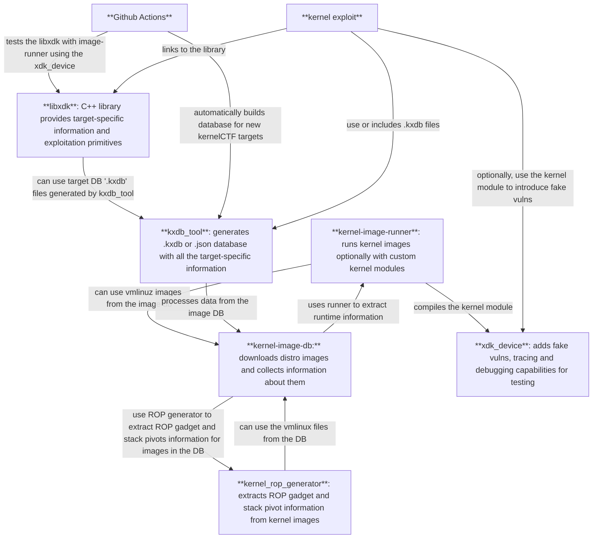

# Introduction

## Rationale behind the kernelXDK

The rationale behind the current beta version of the kernelXDK (Kernel eXploit Development Kit) is pretty simple: we'd like to have exploit which can be easily ported between kernelCTF versions.

Currently we are [paying extra for kernelCTF researchers](https://google.github.io/security-research/kernelctf/rules.html#3-exploits-for-cos-instances) to port their exploits from e.g. LTS to COS and in the majority of the cases the only difference between these two exploits are just the ROP chains or minimal spraying differences.

kernelXDK aims to detach target-specific information (symbol offsets, ROP chain gadgets, structure and kmalloc cache information) from the exploit itself: making the exploits target-independent. This way we can easily introduce new targets for kernelCTF without the need to manually port these exploits to the new targets.

## Limitations

The current beta version of the kernelXDK has several limitations, and should only be looked at as a proof-of-concept, v0.1 or "minimal viable product" version of the kit which only aims to satisfy one goal of many future goals (see the "Future ambitions" section): **make 50% - 90% of kernelCTF exploits work on multiple kernelCTF targets.**

# What is kernelXDK?

kernelXDK is a set of tools which can help kernel researchers to write (currently Linux) kernel exploits more easily.

## Tools

The description of the specific tools can be found in the [README.md](../README.md) file.

This graph shows how the tools interact with each other:

## Future ambitions

### Mid-term plans

We are planning to add the following features to the kernelXDK mid-term (without a promise, also depending on the feedback we get for the Beta):

* More post-RIP approaches

  * `core_pattern` overwrite support
  * [TBD] eBPF spraying support

* KASLR leaks: EntryBleed / prefetch

* Smaller utility features

  * namespace setup
  * CPU pinning
  * communication and synchronization primitives between threads

* Spraying support

  * Most common spraying primitives (`msg_msg`, `msg_msgseg`, `skbuff`, `user_key_payload`, `simple_xattrs`)
  * Automatic limit bypasses (e.g. via forking)
  * Leaking support (if primitive supports it)
  * Victim object identification (determine which specific sprayed object was corrupted)
  * Cross-cache support
  * Dirty Pagetable support

* TBD

### Areas to explore

These areas are moon-shot plans to explore in the future in case kernelXDK deemed to be useful:

* Structured exploits (exploit recipes): add option to create exploits in a declarative manner instead of an imperative one, focus on the "what" instead of the "how".

* Automatic exploit generation: kernelXDK able to chain the right exploit primitives together to reach LPE from vulnerability trigger.

* Syzkaller-integration: generate exploits automatically from crashes.

* Windows, macOS support.
