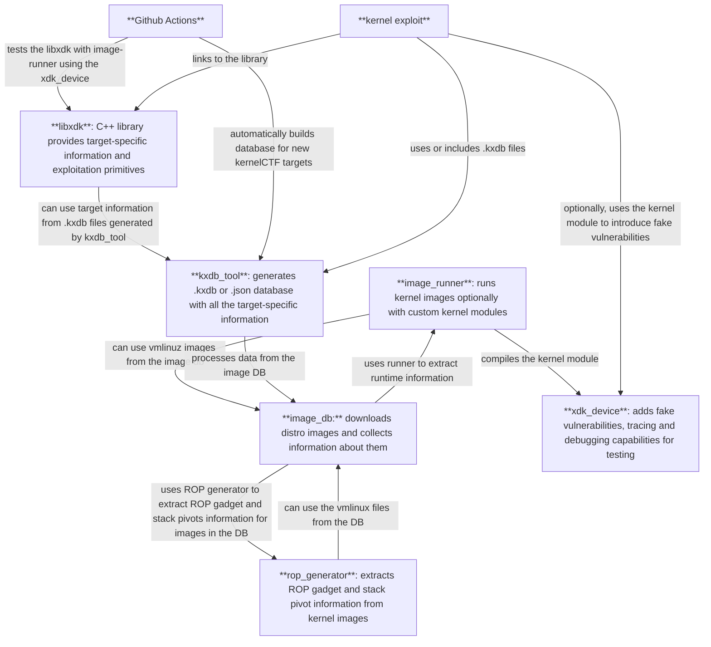

# Introduction

## Rationale behind the kernelXDK

The rationale behind the current Beta version of the kernelXDK (Kernel eXploit Development Kit) is straightforward: we aim to create exploits that can be easily ported between kernelCTF versions.

Currently, we are [compensating kernelCTF researchers extra](https://google.github.io/security-research/kernelctf/rules.html#3-exploits-for-cos-instances) to port their exploits - for example, from LTS to COS. In the majority of cases, the only differences between these two exploits are the ROP chains or minimal spraying variations.

kernelXDK aims to decouple target-specific information (symbol offsets, ROP chain gadgets, structure, and kmalloc cache information) from the exploit itself, thereby making the exploits target-independent. This approach allows us to easily introduce new targets for kernelCTF without the need to manually port existing exploits.

## Limitations

The current beta version of kernelXDK has several limitations and is currently only a proof-of-concept (v0.1, or Minimum Viable Product). It is focused on achieving a single, immediate goal (out of many future goals; see the "Future ambitions" section): **to ensure 50%–90% of kernelCTF exploits work across multiple kernelCTF targets**.

# What is kernelXDK?

kernelXDK is a set of tools designed to help kernel researchers write (currently Linux) kernel exploits more easily.

## Tools

Descriptions of the specific tools are available in the README.md file within each respective folder and on the [xdk.dev](https://xdk.dev) website.

This graph shows how the tools interact with each other:

## Future ambitions

### Mid-term plans

The following features are **currently planned** for the kernelXDK mid-term release. Please note that prioritization and inclusion will depend on the received Beta feedback.

* More post-RIP approaches

  * `core_pattern` overwrite support
  * [TBD] eBPF spraying support

* KASLR leaks: EntryBleed / prefetch

* Smaller utility features

  * namespace setup
  * CPU pinning
  * communication and synchronization primitives between threads

* Spraying support

  * Most common spraying primitives (`msg_msg`, `msg_msgseg`, `skbuff`, `user_key_payload`, `simple_xattrs`)
  * Automatic limit bypasses (e.g. via forking)
  * Leaking support (if primitive supports it)
  * Victim object identification (determine which specific sprayed object was corrupted)
  * Cross-cache support
  * Dirty Pagetable support

### Areas to explore

These represent longer-term ideas we plan to explore if the kernelXDK proves successful:

* **Structured exploits (exploit recipes):** add option to create exploits in a declarative manner instead of an imperative one, focus on the "what" instead of the "how".

* **Automatic exploit generation:** enable kernelXDK to chain the right exploit primitives together to reach LPE from a vulnerability trigger.

* **Syzkaller-integration:** generate exploits automatically from crashes.

* **Windows, macOS support.**
